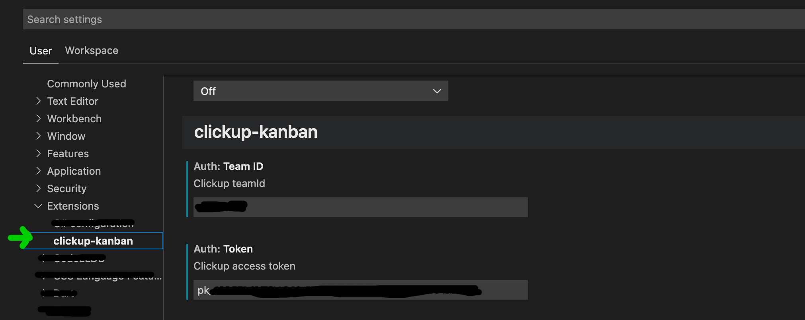

# Clickup Kanbans

## build&install

Build .vsix file extension
`yarn build`

Install the extension from vscode extension tab, click the 3 dots and Install from VSIX...

Fill vscode extension settings with personal api token and team id

## dev

Build the webview in watch mode
`yarn watch`

Than start the extension in debug from vscode (Run->Start debugging or F5)
