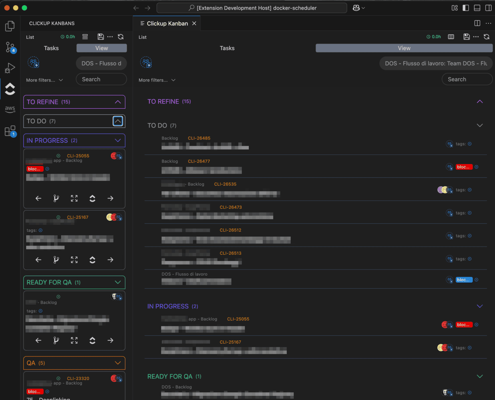
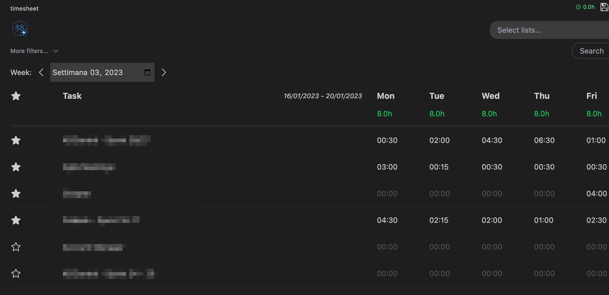
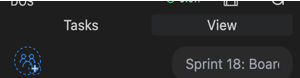
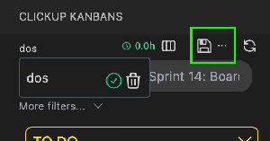

# Clickup Kanbans

Unofficial extension

## configuration

Use command Clickup>Set token to add the clickup authoriation token or open the extension and insert the token from the inside form

Follow the [official guide](https://clickup.com/api/developer-portal/authentication/) to obtain a Personal token

## usage

Use button on sidebar or command Clickup>Open kanban to open full screen view

Use command Clickup>Open timesheet to open timesheet view

#### view mode

With this view mode you can open a clickup view

Select the view from the picker than you can filter tasks by assignees and more...

#### tasks mode

With this view mode you can filter tasks by assignees and lists and more...

#### save views

You can save current configuration clicking on the icon or saving with a new name clicking on the 3 dots

Select saved configurations from the selector that can be opened by clicking on the configuration name on the top left of the screen

#### intl

You can change language and date formatting in the settings

## dev

Build the webview in watch mode
`yarn dev`

Than start the extension in debug from vscode (Run->Start debugging or F5)
