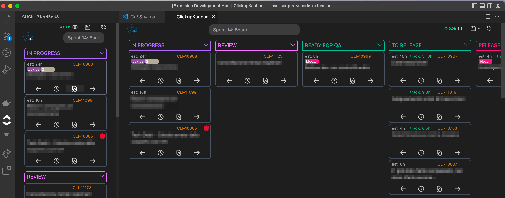

# Clickup Kanbans

Unofficial extension

## configuration

use command Clickup>Set token to add the clickup authoriation token

follow the [official guide](https://clickup.com/api/developer-portal/authentication/) to obtain a Personal token

use button on sidebar or command Clickup>Open kanban to open full screen view

## dev

Build the webview in watch mode
`yarn watch`

Than start the extension in debug from vscode (Run->Start debugging or F5)
